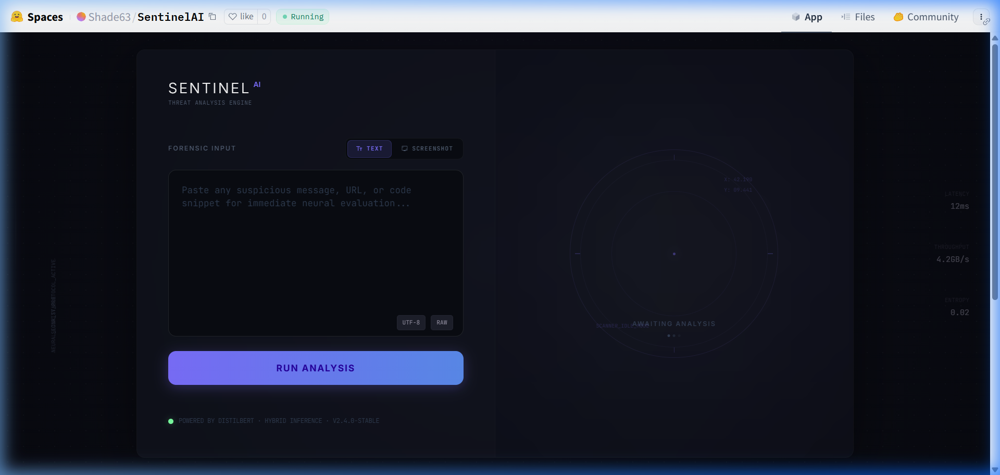
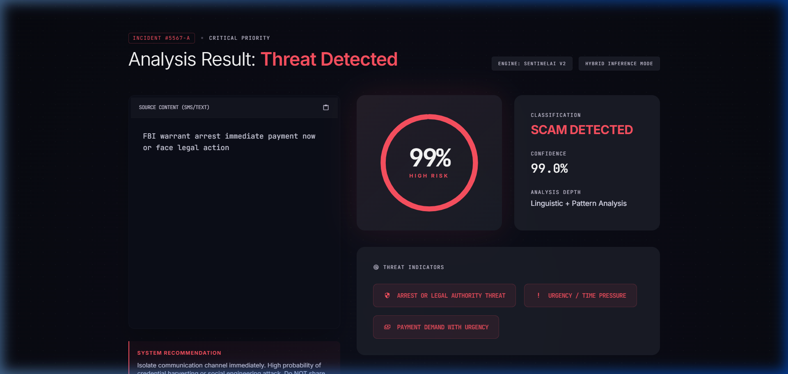
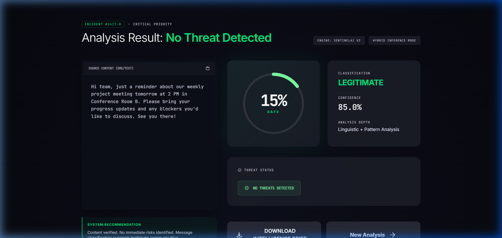
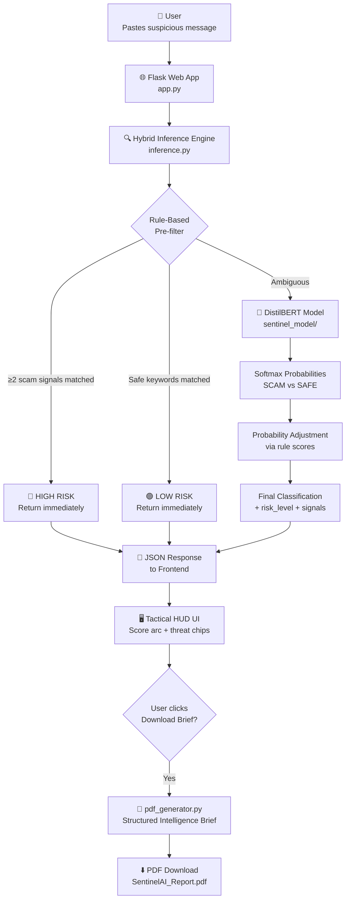
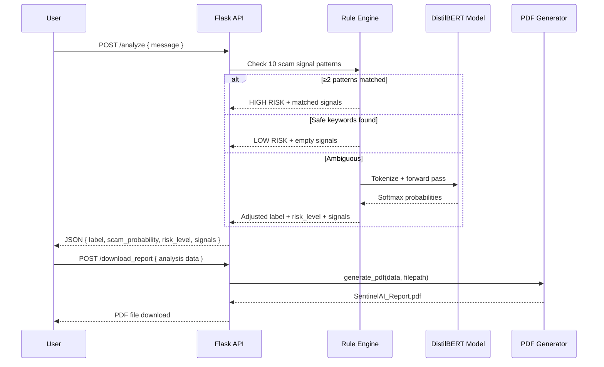

<div align="center">

# 🛡️ SentinelAI

### AI-Powered Digital Threat Intelligence Engine

*Detect scams. Quantify risk. Generate intelligence briefs.*

[](https://python.org)
[](https://flask.palletsprojects.com)
[](https://huggingface.co)
[](https://pytorch.org)
[](/)
[](/)
[](LICENSE)

</div>

---

## 📋 Overview

**SentinelAI** is a real-time digital threat analysis system that uses a **fine-tuned DistilBERT transformer** combined with **rule-based heuristic pre-filtering** to detect digital arrest scams, phishing attempts, and financial fraud in text messages.

The system features:
- A **hybrid inference pipeline** (rules + neural network) achieving **97.42% accuracy**
- A **tactical HUD-style frontend** with animated score visualizations and threat indicator chips
- A **downloadable PDF intelligence brief** formatted like a professional security document

---

## 🖥️ Screenshots

### Idle State — Forensic Input Console
> Two-panel HUD layout: paste a suspicious message and run neural analysis.



---

### Threat Detected — High Risk Result (99% Scam Probability)
> The system detected 3 threat indicators: Authority Threat, Urgency Pressure, and Payment Demand.



---

### No Threat Detected — Safe Result (15% Scam Probability)
> Green classification: message verified as legitimate with 85% confidence.



---

## 🧠 Model Performance

The DistilBERT model was fine-tuned on a **curated digital arrest scam corpus** and evaluated on a held-out test set of **155 samples**.

### Final Evaluation Metrics

| Metric | Score |
|---|---|
| **Accuracy** | **97.42%** |
| **F1 Score** | **97.59%** |
| **Precision** | **97.59%** |
| **Recall** | **97.59%** |

### Confusion Matrix

| | Predicted SAFE | Predicted SCAM |
|---|---|---|
| **Actual SAFE** | 70 | 2 |
| **Actual SCAM** | 2 | 81 |

> Out of 155 test samples, the model produced only **4 misclassifications** (2 false positives + 2 false negatives), achieving a near-perfect detection rate.

### Key Takeaways
- **False Positive Rate**: 2.78% — only 2 out of 72 safe messages were incorrectly flagged
- **False Negative Rate**: 2.41% — only 2 out of 83 scam messages were missed
- **Balanced performance**: Equal precision and recall indicate the model doesn't bias toward either class

---

## ✨ Features

| Feature | Description |
|---|---|
| 🤖 **Fine-Tuned DistilBERT** | Transformer model trained on curated digital scam corpus with 97.42% accuracy |
| ⚡ **Hybrid Inference Engine** | Rule-based pre-screening (10 signal patterns) + neural network fallback |
| 🎯 **Real-Time Risk Scoring** | Probabilistic scam/safe scoring with HIGH / MEDIUM / LOW classification |
| 🔍 **Signal Extraction** | Names specific scam tactics detected (authority threats, urgency pressure, etc.) |
| 🖥️ **Tactical HUD Interface** | Dark-themed dashboard with animated SVG score arcs and threat indicator chips |
| 📄 **PDF Intelligence Brief** | Professional SIB-format report with risk bands, signal tables, and action items |
| ⌨️ **Keyboard Shortcuts** | Ctrl+Enter to run analysis |

---

## 🏗️ System Architecture


```mermaid
flowchart TD
    A["👤 User\nPastes suspicious message"] --> B["🌐 Flask Web App\napp.py"]

    B --> C["🔍 Hybrid Inference Engine\ninference.py"]

    C --> D{"Rule-Based\nPre-filter"}
    D -->|"≥2 scam signals matched"| E["🔴 HIGH RISK\nReturn immediately"]
    D -->|"Safe keywords matched"| F["🟢 LOW RISK\nReturn immediately"]
    D -->|"Ambiguous"| G["🤖 DistilBERT Model\nsentinel_model/"]

    G --> H["Softmax Probabilities\nSCAM vs SAFE"]
    H --> I["Probability Adjustment\nvia rule scores"]
    I --> J["Final Classification\n+ risk_level + signals"]

    E --> K["📡 JSON Response\nto Frontend"]
    F --> K
    J --> K

    K --> L["🖥️ Tactical HUD UI\nScore arc + threat chips"]
    L --> M{"User clicks\nDownload Brief?"}
    M -->|Yes| N["📄 pdf_generator.py\nStructured Intelligence Brief"]
    N --> O["⬇️ PDF Download\nSentinelAI_Report.pdf"]
```

---

## 🔬 Inference Pipeline


```mermaid
sequenceDiagram
    participant U as User
    participant F as Flask API
    participant R as Rule Engine
    participant M as DistilBERT Model
    participant P as PDF Generator

    U->>F: POST /analyze { message }
    F->>R: Check 10 scam signal patterns
    alt ≥2 patterns matched
        R-->>F: HIGH RISK + matched signals
    else Safe keywords found
        R-->>F: LOW RISK + empty signals
    else Ambiguous
        R->>M: Tokenize + forward pass
        M-->>R: Softmax probabilities
        R-->>F: Adjusted label + risk_level + signals
    end
    F-->>U: JSON { label, scam_probability, risk_level, signals }

    U->>F: POST /download_report { analysis data }
    F->>P: generate_pdf(data, filepath)
    P-->>F: SentinelAI_Report.pdf
    F-->>U: PDF file download
```

---

## 🔬 Technical Deep Dive

### Hybrid Inference Strategy

The inference engine uses a **two-stage approach** to maximize both speed and accuracy:

**Stage 1 — Rule-Based Pre-filter** (instant, zero-cost):
- Scans the input against **10 regex-based scam signal patterns**
- If ≥2 patterns match → immediately returns `HIGH RISK` (no model inference needed)
- If safe keywords match and no scam signals → immediately returns `LOW RISK`
- This handles clear-cut cases in **<1ms** without loading the model

**Stage 2 — Neural Network** (for ambiguous cases):
- Tokenizes the input using DistilBERT's WordPiece tokenizer
- Performs a forward pass through the fine-tuned model
- Applies softmax to get SCAM vs SAFE probabilities
- Adjusts probabilities using partial rule scores for better calibration

### Detected Scam Signal Categories

| # | Signal | Example Pattern |
|---|---|---|
| 1 | Arrest / legal authority threat | *"FBI warrant", "CBI enforcement"* |
| 2 | Urgency / time pressure | *"immediate", "within 2 hours"* |
| 3 | Payment demand with urgency | *"transfer funds now"* |
| 4 | Phishing link / click-bait | *"click here to verify"* |
| 5 | Account suspension threat | *"your account is frozen"* |
| 6 | Prize / lottery scam | *"you have won a prize"* |
| 7 | Credential / remote access request | *"share OTP", "install AnyDesk"* |
| 8 | Digital arrest pattern | *"stay on the line"* |
| 9 | Isolation / secrecy demand | *"do not tell anyone"* |
| 10 | Document / ID fraud | *"your Aadhaar is blocked"* |

---

## 📁 Project Structure

```
Sentinel/
│
├── app/
│   ├── app.py                  # Flask routes: /, /analyze, /download_report
│   ├── inference.py            # Hybrid prediction engine (rules + DistilBERT)
│   ├── pdf_generator.py        # Structured Intelligence Brief PDF generator
│   └── templates/
│       └── index.html          # Tactical HUD SPA (Tailwind CSS, dark theme)
│
├── models/
│   ├── sentinel_model/         # Fine-tuned DistilBERT weights
│   │   ├── config.json
│   │   ├── model.safetensors   # ⚠️ 255 MB — not in repo, download separately
│   │   ├── tokenizer.json
│   │   └── tokenizer_config.json
│   ├── train_model.py          # Training script v1
│   └── train_model_v2.py       # Training script v2 (used for final model)
│
├── data/
│   ├── sentinel_dataset_audited.csv     # Curated labeled dataset
│   └── sentinel_dataset_expanded.csv    # Extended dataset for training
│
├── assets/
│   ├── screenshots/            # UI screenshots for README
│   └── process_flow_diagram.png
│
├── requirements.txt
├── .gitignore
└── README.md
```

---

## 🛠️ Tech Stack

| Layer | Technology | Purpose |
|---|---|---|
| **ML Model** | DistilBERT (HuggingFace Transformers) | Fine-tuned binary classifier for scam detection |
| **ML Framework** | PyTorch 2.2 | Tensor operations and model inference |
| **Backend** | Flask 3.0 | REST API serving `/analyze` and `/download_report` |
| **Frontend** | HTML + Tailwind CSS + Vanilla JS | Tactical HUD single-page application |
| **PDF Engine** | ReportLab 4.1 | Generates dark-themed Structured Intelligence Briefs |
| **Data Processing** | Pandas + scikit-learn | Dataset management and evaluation metrics |

---

## ⚙️ Setup & Installation

### Prerequisites
- Python 3.10+
- pip

### 1. Clone the repository
```bash
git clone https://github.com/Shade-63/Sentinel.git
cd Sentinel
```

### 2. Create and activate a virtual environment
```bash
python -m venv env

# Windows
env\Scripts\activate

# macOS / Linux
source env/bin/activate
```

### 3. Install dependencies
```bash
pip install -r requirements.txt
```

### 4. Download the model weights

> ⚠️ `model.safetensors` (~255 MB) is **not included** in this repo due to GitHub's 100 MB file limit.

**Option A — From Releases** *(recommended)*
Download `model.safetensors` from the [Releases page](../../releases) and place it at:
```
models/sentinel_model/model.safetensors
```

**Option B — Train from scratch**
```bash
cd models
python train_model_v2.py
# huggingface-cli download Shade-63/sentinel-model --local-dir models/sentinel_model
```

### 5. Run the application
```bash
cd app
python app.py
```

Open **http://127.0.0.1:5000** in your browser.

---

## 🔌 API Reference

### `POST /analyze`

Analyzes a text message for scam indicators.

**Request:**
```json
{
  "message": "FBI warrant arrest immediate payment"
}
```

**Response:**
```json
{
  "label": "SCAM",
  "scam_probability": 0.99,
  "safe_probability": 0.01,
  "risk_level": "HIGH",
  "signals": [
    "Arrest or legal authority threat",
    "Urgency / time pressure",
    "Payment demand with urgency"
  ]
}
```

### `POST /download_report`

Generates and returns a PDF Structured Intelligence Brief.

**Request:**
```json
{
  "message": "...",
  "risk_score": "99.0",
  "risk_level": "HIGH",
  "signals": ["Arrest or legal authority threat"]
}
```

**Response:** Binary PDF file download

---

## 📄 PDF Report — Structured Intelligence Brief

After analysis, click **DOWNLOAD INTELLIGENCE BRIEF** to get a formatted SIB containing:

```
┌──────────────────────────────────────────────────────────┐
│  SENTINELAI  ·  STRUCTURED INTELLIGENCE BRIEF            │
│  Report ID: SIB-20260320-170900   Generated: 20 Mar 2026 │
├──────────────────────────────────────────────────────────┤
│  ⬛ THREAT INTELLIGENCE REPORT — CONFIDENTIAL            │
├──────────────┬──────────────┬──────────────┬─────────────┤
│ CLASSIFICATION│ REPORT TYPE │ ENGINE       │ TIMESTAMP   │
├──────────────┴──────────────┴──────────────┴─────────────┤
│                                                          │
│   🔴 HIGH RISK — SCAM DETECTED      99.0%                │
│   █████████████████████████████████░ progress bar         │
│                                                          │
├──────────────────────────────────────────────────────────┤
│  01 · INTERCEPTED COMMUNICATION                          │
│  02 · DETECTED RISK INDICATORS      (numbered table)     │
│  03 · AI MODEL INTERPRETATION       (key-value table)    │
│  04 · RECOMMENDED IMMEDIATE ACTIONS (CRITICAL/HIGH/MED)  │
├──────────────────────────────────────────────────────────┤
│  CONFIDENTIAL — FOR AUTHORIZED USE ONLY    Page 1        │
└──────────────────────────────────────────────────────────┘
```

---

## 🚀 What Makes This Different

| Aspect | SentinelAI | Simple Keyword Matching |
|---|---|---|
| **Detection Method** | Fine-tuned transformer + rule engine | Static keyword lists |
| **Accuracy** | 97.42% | ~70% (high false-positive rate) |
| **Context Understanding** | Understands sentence-level semantics | Matches isolated words |
| **Signal Extraction** | Names specific tactics used | No explanation |
| **Risk Quantification** | Probabilistic score (0-100%) | Binary yes/no |
| **Output** | Professional PDF intelligence brief | Plain text alert |

---

## ⚠️ Disclaimer

SentinelAI provides AI-based probabilistic risk estimation and does **not** constitute legal advice. All findings are based on pattern recognition and should be verified through official law enforcement or financial authorities. This tool is intended for educational and informational purposes only.

---

<div align="center">

**Built with** Flask · HuggingFace Transformers · PyTorch · ReportLab

*Protecting innocents from digital threats through AI-powered intelligence*

Built with ❤️ using Flask · HuggingFace Transformers · ReportLab
</div>
