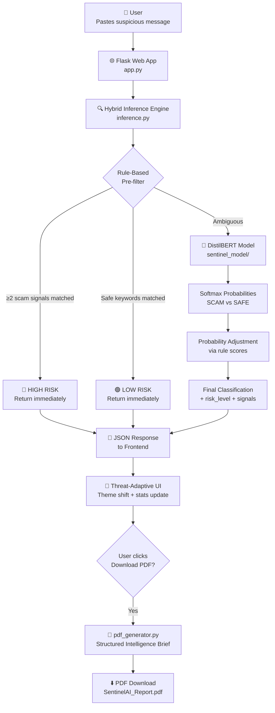
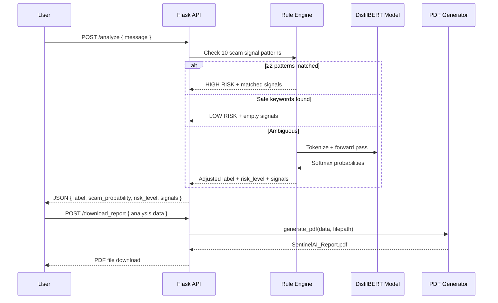

<div align="center">

# 🛡️ SentinelAI

### AI-Powered Digital Threat Risk Analyzer

*Detect scams. Understand threats. Act fast.*

[](https://python.org)
[](https://flask.palletsprojects.com)
[](https://huggingface.co)
[](https://reportlab.com)
[](LICENSE)

</div>

---

## � Overview

**SentinelAI** is a real-time digital threat analysis system that uses a **fine-tuned DistilBERT transformer** combined with rule-based heuristics to detect digital arrest scams, phishing attempts, and financial fraud in text messages.

Results are displayed through a **threat-adaptive UI** that dynamically shifts color themes based on risk level, and can be exported as a professional **Structured Intelligence Brief (SIB)** PDF report — formatted like a real security intelligence document.

---

## 🖥️ Screenshots

### 1 · Initial State — Awaiting Input
> Neutral cyan theme. Paste any suspicious message to begin analysis.


---

### 2 · Safe Message Detected — Green Theme
> The UI shifts to a green security theme when the message is classified as legitimate.


---

### 3 · Threat Detected — Red Alert Theme
> The UI switches to a red critical alert theme when a scam is detected.


---

### 4 · Structured Intelligence Brief — PDF Report (Page 1)
> Downloadable PDF with risk score, classification band, intercepted message, and detected indicators.


---

### 5 · Structured Intelligence Brief — PDF Report (Page 2)
> AI model interpretation, prioritized action table, and confidential footer.


---

## ✨ Features

| Feature | Description |
|---|---|
| 🤖 **AI Detection** | Fine-tuned DistilBERT on a curated digital scam corpus |
| ⚡ **Hybrid Inference** | Rule-based pre-screening + transformer model for high accuracy |
| 🎨 **Threat-Adaptive UI** | Color theme shifts live: cyan → 🟢 green (safe) / 🔴 red (scam) |
| 📄 **PDF Intelligence Brief** | Professional SIB-format report with risk bands, signal tables, action items |
| 📊 **Risk Scoring** | Probabilistic scam/safe score with HIGH / MEDIUM / LOW classification |
| 🔍 **Signal Extraction** | Identifies and names specific scam indicators found in the message |

---

## 🏗️ System Architecture


```mermaid
flowchart TD
    A["👤 User\nPastes suspicious message"] --> B["🌐 Flask Web App\napp.py"]

    B --> C["🔍 Hybrid Inference Engine\ninference.py"]

    C --> D{"Rule-Based\nPre-filter"}
    D -->|"≥2 scam signals matched"| E["🔴 HIGH RISK\nReturn immediately"]
    D -->|"Safe keywords matched"| F["🟢 LOW RISK\nReturn immediately"]
    D -->|"Ambiguous"| G["🤖 DistilBERT Model\nsentinel_model/"]

    G --> H["Softmax Probabilities\nSCAM vs SAFE"]
    H --> I["Probability Adjustment\nvia rule scores"]
    I --> J["Final Classification\n+ risk_level + signals"]

    E --> K["📡 JSON Response\nto Frontend"]
    F --> K
    J --> K

    K --> L["🎨 Threat-Adaptive UI\nTheme shift + stats update"]
    L --> M{"User clicks\nDownload PDF?"}
    M -->|Yes| N["📄 pdf_generator.py\nStructured Intelligence Brief"]
    N --> O["⬇️ PDF Download\nSentinelAI_Report.pdf"]
```

---

## 🔬 Inference Pipeline


```mermaid
sequenceDiagram
    participant U as User
    participant F as Flask API
    participant R as Rule Engine
    participant M as DistilBERT Model
    participant P as PDF Generator

    U->>F: POST /analyze { message }
    F->>R: Check 10 scam signal patterns
    alt ≥2 patterns matched
        R-->>F: HIGH RISK + matched signals
    else Safe keywords found
        R-->>F: LOW RISK + empty signals
    else Ambiguous
        R->>M: Tokenize + forward pass
        M-->>R: Softmax probabilities
        R-->>F: Adjusted label + risk_level + signals
    end
    F-->>U: JSON { label, scam_probability, risk_level, signals }

    U->>F: POST /download_report { analysis data }
    F->>P: generate_pdf(data, filepath)
    P-->>F: SentinelAI_Report.pdf
    F-->>U: PDF file download
```

---

## 📁 Project Structure

```
Sentinel/
│
├── app/
│   ├── app.py                  # Flask routes: /analyze, /download_report
│   ├── inference.py            # Hybrid prediction engine (rules + DistilBERT)
│   ├── pdf_generator.py        # Structured Intelligence Brief PDF generator
│   └── templates/
│       └── index.html          # Threat-adaptive UI (Tailwind CSS, dark theme)
│
├── models/
│   ├── sentinel_model/         # Fine-tuned DistilBERT weights (see note below)
│   │   ├── config.json
│   │   ├── model.safetensors   # ⚠️ 255 MB — not in repo, download separately
│   │   ├── tokenizer.json
│   │   └── tokenizer_config.json
│   ├── train_model.py          # Training script v1
│   └── train_model_v2.py       # Training script v2
│
├── data/
│   └── sentinel_dataset_audited.csv   # Labeled training dataset
│
├── assets/
│   └── screenshots/            # UI and PDF screenshots for README
│
├── requirements.txt
├── .gitignore
└── README.md
```

---

## ⚙️ Setup & Installation

### Prerequisites
- Python 3.10+
- pip

### 1. Clone the repository
```bash
git clone https://github.com/Shade-63/Sentinel.git
cd Sentinel
```

### 2. Create and activate a virtual environment
```bash
python -m venv env

# Windows
env\Scripts\activate

# macOS / Linux
source env/bin/activate
```

### 3. Install dependencies
```bash
pip install -r requirements.txt
```

### 4. Download the model weights

> ⚠️ `model.safetensors` (~255 MB) is **not included** in this repo due to GitHub's 100 MB file limit.

**Option A — From Releases** *(recommended)*
Download `model.safetensors` from the [Releases page](../../releases) and place it at:
```
models/sentinel_model/model.safetensors
```

**Option B — HuggingFace Hub** *(coming soon)*
```bash
# huggingface-cli download Shade-63/sentinel-model --local-dir models/sentinel_model
```

### 5. Run the application
```bash
cd app
python app.py
```

Open **http://127.0.0.1:5000** in your browser.

---

## 🧠 Model Details

| Property | Value |
|---|---|
| Base Model | `distilbert-base-uncased` |
| Task | Binary Sequence Classification (SCAM / SAFE) |
| Training Data | Custom curated digital arrest scam dataset |
| Inference Strategy | Hybrid: rule-based pre-filter → transformer fallback |
| Risk Levels | `HIGH` (≥75% scam prob) · `MEDIUM` (50–74%) · `LOW` (<50%) |

### Detected Scam Signal Categories

| # | Signal | Example Pattern |
|---|---|---|
| 1 | Arrest / legal authority threat | *"FBI warrant", "CBI enforcement"* |
| 2 | Urgency / time pressure | *"immediate", "within 2 hours"* |
| 3 | Payment demand with urgency | *"transfer funds now"* |
| 4 | Phishing link / click-bait | *"click here to verify"* |
| 5 | Account suspension threat | *"your account is frozen"* |
| 6 | Prize / lottery scam | *"you have won a prize"* |
| 7 | Credential / remote access request | *"share OTP", "install AnyDesk"* |
| 8 | Digital arrest pattern | *"stay on the line"* |
| 9 | Isolation / secrecy demand | *"do not tell anyone"* |
| 10 | Document / ID fraud | *"your Aadhaar is blocked"* |

---

## 📄 PDF Report — Structured Intelligence Brief

After analysis, click **Download PDF Report** to get a formatted SIB containing:

```
┌─────────────────────────────────────────────────────────┐
│  SENTINELAI  ·  STRUCTURED INTELLIGENCE BRIEF           │
│  Report ID: SIB-20260218-124058   Generated: 18 Feb 2026│
├─────────────────────────────────────────────────────────┤
│  ⬛ THREAT INTELLIGENCE REPORT — CONFIDENTIAL           │
├──────────────┬──────────────┬──────────────┬────────────┤
│ CLASSIFICATION│ REPORT TYPE │ ENGINE       │ TIMESTAMP  │
├──────────────┴──────────────┴──────────────┴────────────┤
│                                                         │
│   🔴 HIGH RISK — SCAM DETECTED      81.4%               │
│   ████████████████████████████░░░░░ progress bar        │
│                                                         │
├─────────────────────────────────────────────────────────┤
│  01 · INTERCEPTED COMMUNICATION                         │
│  02 · DETECTED RISK INDICATORS      (numbered table)    │
│  03 · AI MODEL INTERPRETATION       (key-value table)   │
│  04 · RECOMMENDED IMMEDIATE ACTIONS (CRITICAL/HIGH/MED) │
├─────────────────────────────────────────────────────────┤
│  CONFIDENTIAL — FOR AUTHORIZED USE ONLY    Page 1       │
└─────────────────────────────────────────────────────────┘
```

---

## ⚠️ Disclaimer

SentinelAI provides AI-based probabilistic risk estimation and does **not** constitute legal advice. All findings are based on pattern recognition and should be verified through official law enforcement or financial authorities. This tool is intended for educational and informational purposes only.

---

## 📜 License

MIT License — see [LICENSE](LICENSE) for details.

---

<div align="center">

Built with ❤️ using Flask · HuggingFace Transformers · ReportLab
</div>
